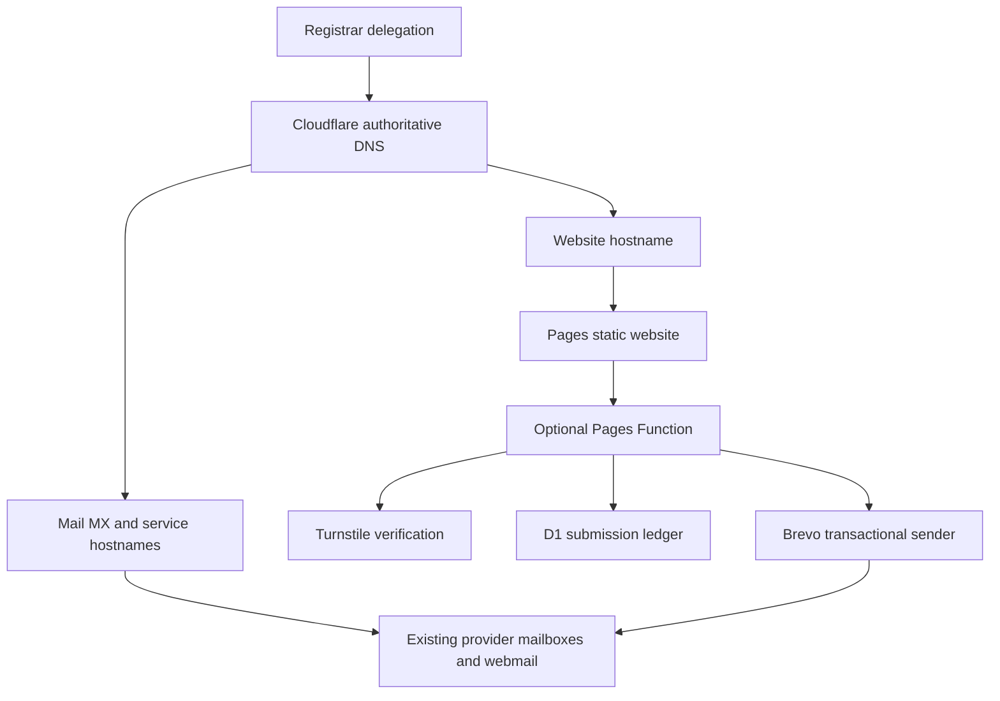

# Cloudflare deployment, DNS and migration guide

This standalone guide describes a static website on **Cloudflare Pages**, optional
server-side forms, and a domain whose email remains with an existing hosting
provider. It can be copied into another project without this repository or its
conversation history. Every domain, IP address and project name below is an
example; replace them with verified project values.

Last platform documentation review: **2026-09-26**. Recheck permissions, plan
limits and dashboard labels before provisioning. A host repository's agent
instructions, architecture decisions and release gates remain authoritative.
Workers, SSR applications, domain-registration transfers and mailbox migrations
require their own deployment plans.

## Contents

- [1. What each service controls](#1-what-each-service-controls)
- [2. Environments and release ownership](#2-environments-and-release-ownership)
- [3. Access and the operational record](#3-access-and-the-operational-record)
- [4. DNS inventory and backups](#4-dns-inventory-and-backups)
- [5. Preserve email and hosting services](#5-preserve-email-and-hosting-services)
- [6. Prepare Pages and optional forms](#6-prepare-pages-and-optional-forms)
- [7. Move authoritative DNS](#7-move-authoritative-dns)
- [8. Move the website to production](#8-move-the-website-to-production)
- [9. Acceptance checks](#9-acceptance-checks)
- [10. Rollback](#10-rollback)
- [11. Troubleshooting](#11-troubleshooting)
- [12. Handoff and ongoing maintenance](#12-handoff-and-ongoing-maintenance)

## 1. What each service controls

| Service                            | Responsibility                                                                       | Where changes belong                               |
| ---------------------------------- | ------------------------------------------------------------------------------------ | -------------------------------------------------- |
| Domain registrar                   | Registration, renewal, parent-zone nameserver delegation and DNSSEC DS records       | Registrar's domain settings                        |
| Authoritative DNS provider         | Public records for the domain                                                        | Cloudflare DNS after delegation becomes active     |
| Cloudflare proxy                   | HTTP traffic, eligible edge security, caching and redirects                          | Settings and rules for proxied hostnames           |
| Pages                              | Static builds, deployments and custom-domain associations                            | Pages project and repository build configuration   |
| Pages Functions                    | Runtime endpoints, such as form submissions                                          | Function code, runtime variables and bindings      |
| Turnstile                          | Browser challenge and server verification                                            | Widget configuration and matching application keys |
| D1                                 | Application database, such as a submission ledger                                    | Environment-specific database and migrations       |
| Existing hosting provider / cPanel | Mailboxes, passwords, storage, forwarding, webmail and any retained hosting services | Provider dashboard and cPanel                      |
| Brevo                              | Transactional sending and sender/domain authentication                               | Brevo account and authentication DNS records       |
| Git and CI                         | Reviewed source, release approval and build checks                                   | Repository and branch protection                   |

Changing nameservers does **not** transfer domain registration, move mailbox
contents or cancel hosting. Keeping email requires an active email service and
correct public DNS. Brevo sending does not replace the provider's incoming mailboxes.



After activation, cPanel's zone editor generally no longer controls public DNS
for this domain. It may still display an old local zone. There is no automatic
synchronization unless explicitly configured. New mailbox creation still belongs
in cPanel; any resulting public DKIM, SPF or service-record changes belong in
Cloudflare as well.

## 2. Environments and release ownership

Cloudflare Pages has **Production** and **Preview** configuration environments.
A branch named `staging` normally uses Preview; it is not a third binding environment.

| Target                    | Example                                     | Purpose                                                        |
| ------------------------- | ------------------------------------------- | -------------------------------------------------------------- |
| Local                     | Local development server                    | Development with local resources or documented test keys       |
| Stable staging            | `staging.example-project.pages.dev`         | Repeatable Preview review and integration testing              |
| Deployment URL            | `<deployment-id>.example-project.pages.dev` | Inspect a specific deployment                                  |
| Production project URL    | `example-project.pages.dev`                 | Inspect the production deployment before custom-domain cutover |
| Production custom domains | `example.com`, `www.example.com`            | Public website and chosen canonical hostname                   |

Set the production branch explicitly; do not infer `main` or `master`. If only
`staging` should build previews automatically, configure Preview branch controls
with that inclusion and no unrelated inclusions. A push can trigger a build
without a pull request. Branch controls govern automatic builds, not user access
or every manual deployment path. See [branch build controls](https://developers.cloudflare.com/pages/configuration/branch-build-controls/).

The stable branch alias moves to newer deployments. Deployment URLs identify
individual releases. Preview responses use `X-Robots-Tag: noindex` by default;
that prevents indexing, not access. Use access controls when previews contain
private information. Inspect the actual branch alias before configuring exact
hostname allowlists. See [Preview deployments](https://developers.cloudflare.com/pages/configuration/preview-deployments/).

Keep Preview and Production databases, Turnstile widgets and idempotency secrets
separate. Staging notifications should go to controlled test recipients. Do not
assume a deployment URL's forms work when only the stable alias is authorized.

Required checks and human review must finish before an approved production
release. A successful Cloudflare build is not evidence that repository quality
gates passed. GitHub post-merge CI and Cloudflare Git deployments can start
independently; record the source commit and deployment ID together. See
[Git integration](https://developers.cloudflare.com/pages/configuration/git-integration/github-integration/).

## 3. Access and the operational record

Use scoped API tokens for the intended account and zones. Store secret values in
an approved secret store or ignored local environment file; never commit them,
print complete API responses containing them, or include them in evidence files.

| Intended operation                     | Permission area to check                                                           |
| -------------------------------------- | ---------------------------------------------------------------------------------- |
| Read an existing zone and edit records | Zone Read and DNS Edit for that zone                                               |
| Create a zone                          | Permissions accepted by the zone-creation endpoint, with the correct account scope |
| Configure Pages                        | Account-level Cloudflare Pages Edit                                                |
| Provision databases                    | Account-level D1 Edit                                                              |
| Manage widgets                         | Account-level Turnstile Edit                                                       |
| Change general zone settings           | Zone Settings Edit                                                                 |
| Change certificate / HTTPS options     | SSL and Certificates Edit, as required by the endpoint                             |
| Create rate-limit rules                | Zone WAF Edit, as required by the endpoint                                         |
| Create hostname or HTTPS redirects     | Single Redirect Edit; some interfaces use Dynamic URL Redirects naming             |

Permission names and accepted combinations can change. Check the exact endpoint
and resource scope before requesting access; DNS Edit alone does not establish
zone-creation access. Preserve already-required permissions when updating a token.
References: [token creation](https://developers.cloudflare.com/fundamentals/api/get-started/create-token/),
[permission reference](https://developers.cloudflare.com/fundamentals/api/reference/permissions/)
and [zone creation](https://developers.cloudflare.com/api/resources/zones/methods/create/).

For API automation, read the current resource first, plan the smallest change,
and preserve unrelated settings. Nested project configuration or ruleset updates
can replace existing values. Read back the result and save a sanitized diff;
an HTTP success alone does not establish the intended final configuration.

For a 401/403, distinguish invalid credentials, wrong account, missing permission,
resource scope, token expiry and provider IP restrictions. Do not repeatedly
retry a rejected mutation or broaden permissions without identifying the operation.

Maintain a **separate dated operational record** for each real project:

```yaml
domain: example.com
checked_at: REPLACE_WITH_UTC_TIMESTAMP
registrar: REPLACE_WITH_PROVIDER
cloudflare_account_id: REPLACE_WITH_ACCOUNT_ID
cloudflare_zone_id: REPLACE_WITH_ZONE_ID
assigned_nameservers: [] # Record the exact names assigned to this zone.
pages_project: example-project
production_branch: REPLACE_WITH_APPROVED_BRANCH
staging_branch: staging
build_root: REPLACE_WITH_BUILD_ROOT
build_command: REPLACE_WITH_VERIFIED_COMMAND
output_directory: REPLACE_WITH_OUTPUT_DIRECTORY
production_commit: unknown
production_deployment_id: unknown
dns_activation: unknown
website_cutover: not_started
mail_provider: REPLACE_WITH_PROVIDER
mail_verified_at: unknown
secret_store_reference: REPLACE_WITH_LOCATION_REFERENCE_ONLY
rollback_artifact: REPLACE_WITH_APPROVED_RELEASE_REFERENCE
```

Record databases, widget site keys, hostname allowlists, rule IDs, DNS backups and
verification evidence there too. **Configured**, **deployed** and **verified**
are different states. Creating a database or saving a secret does not prove the
currently serving deployment uses it.

## 4. DNS inventory and backups

Before changing records:

1. Export the old provider's zone and record the registrar's current delegation.
2. Inventory every record, including uncommon types, wildcard records, delegated
   subdomains, verification records and DNSSEC state.
3. Record which service owns each record and which hostnames depend on the root domain.
4. Save a baseline before importing and another snapshot before website cutover.
5. Compare imported records by name, type and complete value, not just total count.

Prefer the provider's native export or a BIND zone file for interoperable DNS
restoration. Add JSON for structured comparisons, complete TXT segments and
provider metadata; Markdown is useful for explanations but should not be the
only backup. Cloudflare supports [zone import and export](https://developers.cloudflare.com/dns/manage-dns-records/how-to/import-and-export/).

A portable JSON representation can look like this:

```json
{
  "schema_version": 1,
  "zone": "example.com.",
  "source": "provider export",
  "coverage": {
    "complete": false,
    "limitations": ["Example contains selected records only"]
  },
  "records": [
    {
      "name": "mail.example.com.",
      "type": "A",
      "class": "IN",
      "ttl": 14400,
      "content": "203.0.113.10",
      "proxied": false
    },
    {
      "name": "example.com.",
      "type": "MX",
      "class": "IN",
      "ttl": 14400,
      "priority": 10,
      "exchange": "mail.example.com."
    },
    {
      "name": "selector._domainkey.example.com.",
      "type": "TXT",
      "class": "IN",
      "ttl": 14400,
      "text_segments": ["first-part", "second-part"]
    }
  ]
}
```

`203.0.113.10` is a documentation address, not a usable hosting destination.
For SRV records also preserve priority, weight, port and target. Preserve multiple
records with the same owner and type. Keep absolute names unambiguous, with
trailing dots in exports where appropriate.

A TXT record split into several character strings remains **one record**.
Consumers such as DKIM combine its segments without added spaces. Preserve both
the segments and their order; never convert a split key into separate TXT records.

HTML extraction is a snapshot of visible values, not necessarily a complete zone
export. Check pagination, filters, omitted rows, missing SOA/NS TTLs and truncation.
Record missing information explicitly. DNS scans can miss records and cannot
recover mailbox settings. Historic ACME challenge values are not fresh certificates
or valid future challenges.

For a standard Cloudflare primary zone, use Cloudflare's assigned apex NS and
managed SOA. Do not import the old provider's apex NS as the new delegation.
Preserve intentional subdomain delegations and inspect their DS/DNSSEC relationships.

### DNS-only and proxied records

**DNS only** returns the configured destination. **Proxied** routes eligible web
traffic through Cloudflare. Proxy status changes connectivity, not merely a
visual setting. See [proxy status](https://developers.cloudflare.com/dns/proxy-status/).

| Record or service                               | Migration policy                                                           |
| ----------------------------------------------- | -------------------------------------------------------------------------- |
| Existing website during DNS-only migration      | Retain the old destination; DNS only provides a simple baseline            |
| Website on Pages after approved cutover         | Configure the Pages domain and appropriate proxied website records         |
| SMTP, IMAP, POP, FTP and provider service hosts | DNS only unless an explicitly supported separate proxy service is designed |
| MX, TXT and ordinary SRV records                | No orange-cloud proxy switch; preserve full values                         |
| Mail-provider or Brevo DKIM CNAMEs              | DNS only                                                                   |
| NS for delegated subdomains                     | Preserve intentional delegation                                            |

Inspect the entire CNAME chain. A DNS-only `mail` alias pointing to a proxied
root domain can still resolve to Cloudflare addresses and break ordinary email.
Keeping a provider mail IP public is expected for direct mail delivery.

TTL influences caching; it is not an instant rollback mechanism. Cloudflare
proxied records use automatic TTL. Lowering an A-record TTL does not expire
parent nameserver delegation or already-cached DS records.

## 5. Preserve email and hosting services

Separate the **DNS move** from the **website move**. First make Cloudflare serve
the existing destinations. Later change only the verified website dependencies.

Before moving the root domain to Pages, inspect these common dependencies:

| Existing dependency                            | Preparation before website cutover                                        |
| ---------------------------------------------- | ------------------------------------------------------------------------- |
| MX points to `example.com`                     | Use a verified provider mail hostname backed by provider addresses        |
| `mail` CNAME points to the root                | Give it a provider-backed DNS-only destination independent of the website |
| `ftp` CNAME points to the root                 | Retain a verified provider service hostname                               |
| Calendar/contact SRV targets point to the root | Use verified provider-backed targets; retain priority, weight and port    |
| SPF contains `a` or `mx`                       | Review what those mechanisms authorize after the changes                  |
| Browser webmail uses `example.com/webmail`     | Establish a provider webmail URL or independent webmail hostname          |

Do not choose targets solely because they resolve. Verify the provider accepts
the service there and that TLS certificates match the hostname. Ask the provider
when destinations, IPv6 support or calendar service behavior are uncertain.

Keep provider SPF, DKIM and DMARC requirements intact. Maintain one SPF policy
record for each relevant owner, combining only verified authorized senders.
Different providers may use separate DKIM selectors. Do not invent a Brevo SPF
include, replace a working DKIM key, or tighten DMARC during an unrelated cutover.
See [email DNS records](https://developers.cloudflare.com/dns/manage-dns-records/how-to/email-records/).

Check cPanel **Email Routing** for the domain. Locally hosted mailboxes need the
provider to accept local delivery; automatic detection may rely on its local zone,
which can differ from public Cloudflare DNS. Confirm the appropriate setting
with the provider rather than choosing Remote just because DNS moved. See
[cPanel Email Routing](https://docs.cpanel.net/cpanel/email/email-routing/).

Keep the provider's email subscription, mailboxes and webmail access active.
Do not enable Cloudflare Email Routing as part of this preservation procedure:
it introduces a different incoming-mail configuration that needs its own plan.
Verify both external incoming mail and outgoing mail, including replies, with the
account owner. A TLS connection or DNS lookup alone does not prove delivery.

## 6. Prepare Pages and optional forms

### Build and deployment configuration

1. Inspect the repository's current deployment configuration and approved commands.
2. Choose Git integration or Direct Upload intentionally; inspect the existing
   project type before proposing a different publishing workflow.
3. Set the project root, build command, output directory, tool versions and branch controls.
4. Configure Preview resources first, deploy the approved staging commit, and test it.
5. Configure Production resources separately and deploy an approved production commit.
6. Confirm the serving deployment's commit, compiled configuration and runtime bindings.

For a pnpm monorepo, a build might use `pnpm --filter <site-package> build` with
output `site/<site>/dist`. This is a pattern, not a command to copy without
checking package scripts and generation requirements. Do not publish an
unreviewed local working tree or an artifact built with test widget keys.

Ensure Functions are included in the deployment and that routing is deliberate.
Use `_routes.json` when appropriate to limit Function execution to intended
endpoints. Static `_headers` and `_redirects` do not apply to responses served by
Functions; set necessary headers and redirects in Function code. References:
[Function routing](https://developers.cloudflare.com/pages/functions/routing/),
[headers](https://developers.cloudflare.com/pages/configuration/headers/) and
[redirects](https://developers.cloudflare.com/pages/configuration/redirects/).

### Optional form infrastructure

Variable names below illustrate a form contract. Adapt them to verified code;
Cloudflare does not automatically implement a form backend from these names.

| Configuration                             | Placement             | Environment policy                                                              |
| ----------------------------------------- | --------------------- | ------------------------------------------------------------------------------- |
| `PUBLIC_TURNSTILE_SITE_KEY`               | Public build variable | Matching widget for the compiled site                                           |
| `FORM_ENVIRONMENT`                        | Runtime variable      | Explicit Preview or Production value                                            |
| `TURNSTILE_ALLOWED_HOSTS`                 | Runtime variable      | Approved exact hostnames                                                        |
| `TURNSTILE_SECRET_KEY`                    | Runtime secret        | Matching private verification key                                               |
| `FORM_IDEMPOTENCY_SECRET`                 | Runtime secret        | Independent high-entropy HMAC secret per environment                            |
| `BREVO_API_KEY`                           | Runtime secret        | Authorized sending credential                                                   |
| `BREVO_SENDER_EMAIL`, `BREVO_SENDER_NAME` | Runtime configuration | Verified sender identity                                                        |
| `BREVO_TO_EMAIL`                          | Runtime configuration | Controlled test recipients in Preview; approved office recipients in Production |
| `FORM_DB`                                 | D1 binding            | Separate Preview and Production databases                                       |

Apply the actual database migrations in order and record migration history.
Avoid blindly replaying schema SQL or clearing a live submission ledger.
Keep stored personal data minimal, with an explicit retention policy and access
controls. References: [D1 migrations](https://developers.cloudflare.com/d1/reference/migrations/)
and [Pages bindings](https://developers.cloudflare.com/pages/functions/bindings/).

A reliable submission flow validates request size, origin/host, method, content
type and canonical fields; verifies Turnstile server-side with the expected
action and hostname; claims a durable submission ID; sends; and records the
provider response. Turnstile alone does not provide duplicate-send prevention.

If sending times out after the provider may have accepted the message, retain an
uncertain state and reconcile it. Automatically resending can produce duplicates.
Provider acceptance is not proof of inbox delivery.

Use real widgets for deployment acceptance. A public site key is safe to expose;
its secret verification key is not. Updating a public build variable requires a
fresh build. Redeploy after runtime secret or binding changes and verify the new
deployment. See [Turnstile setup](https://developers.cloudflare.com/turnstile/get-started/)
and [Pages bindings](https://developers.cloudflare.com/pages/functions/bindings/).

### Brevo and security

Verify the sending domain and sender using the exact records Brevo supplies.
Use the verified address as `From`; use a validated visitor address as `Reply-To`
when the application requires replies. Test through the deployed Function as
well as from the operator's workspace.

Brevo IP restrictions can reject an otherwise valid API key. Authorizing the
workspace IP does not prove Cloudflare runtime egress is authorized. Establish a
provider-supported policy for that runtime, or an explicitly reviewed fixed-egress
design; do not assume serverless egress matches the workstation or disable the
account's security controls to hide the issue. See [Brevo IP security](https://developers.brevo.com/docs/ip-security).

Choose form rate limits based on legitimate traffic and the current plan. At the
review date, Free supports one rate-limit rule with a 10-second period and
10-second mitigation; available matching fields are restricted. A 10-request
threshold is an application choice. Validate the accepted expression and action
with the current [rate-limit documentation](https://developers.cloudflare.com/waf/rate-limiting-rules/).

Zone WAF rules apply to eligible traffic through that zone, not automatically to
the project's `pages.dev` endpoints. Account for alternate hostnames with verified
application host controls, appropriate access controls or supported redirects.

Preserve the host project's CSP and security-header requirements. Distinguish
enforced CSP from Report-Only. Configure suitable TLS and HTTPS policies; Full
(strict) requires a valid origin certificate when proxying an external origin.
Evaluate all affected hosts before enabling HSTS subdomain coverage or preload.
See [Full (strict) requirements](https://developers.cloudflare.com/ssl/origin-configuration/ssl-modes/full-strict/).

## 7. Move authoritative DNS

### DNSSEC before delegation

Inventory the parent DS record before moving nameservers. For a migration with
an approved temporary unsigned interval, remove the old DS at the registrar,
verify publication and wait for its previous TTL to expire before changing
nameservers or disabling the old signer. Otherwise validating resolvers can fail.

If uninterrupted DNSSEC is required, use a separately planned supported signed
migration. Once Cloudflare is active, enable its DNSSEC, publish its supplied DS
at the registrar and verify the chain. Never combine one provider's DS with
another provider's keys. See [Cloudflare DNSSEC](https://developers.cloudflare.com/dns/dnssec/)
and the [signed migration tutorial](https://developers.cloudflare.com/dns/dnssec/dnssec-active-migration/).

### Activation sequence

1. Create or locate the Cloudflare zone in the intended account using the approved plan.
2. Reconcile the scan against the full backup. Save a Cloudflare baseline snapshot.
3. Preserve existing website and email destinations while preparing service dependencies.
4. Read the nameservers assigned to **this zone**. Never reuse another domain's pair.
5. At the registrar, replace the existing delegation with that assigned set.
6. Record owner confirmation and the time; verify parent delegation and DNS responses.
7. Request an activation check if available, then allow caches and provider publication to settle.

Standard full setup typically assigns two Cloudflare nameservers; advanced
setups can differ. This guide assumes standard full setup. See
[full setup](https://developers.cloudflare.com/dns/zone-setups/full-setup/setup/).

The registrar screen, parent-zone delegation, old provider's apex NS records and
cached resolver results can disagree temporarily. An old cPanel server listed in
the old zone does not establish that it remains in the parent delegation. Do not
delete mailboxes or hosting because an old nameserver name remains visible.
Verify the parent first. See [pending nameserver troubleshooting](https://developers.cloudflare.com/dns/zone-setups/troubleshooting/pending-nameservers/).

Read-only diagnostic examples:

```bash
dig +short NS example.com
dig +trace example.com NS
dig example.com DS
dig @<parent-authoritative-nameserver> example.com NS +norecurse
dig @<assigned-cloudflare-nameserver> example.com A
dig @<assigned-cloudflare-nameserver> example.com MX
dig @<assigned-cloudflare-nameserver> mail.example.com A
dig @<assigned-cloudflare-nameserver> selector._domainkey.example.com TXT
```

Replace bracketed placeholders before running. Compare authoritative answers with
several recursive resolvers. Registry WHOIS/RDAP can corroborate recorded changes,
but authoritative parent responses show delegation. If a workspace blocks direct
DNS traffic, use an available independent resolver or external diagnostic service;
record the limitation rather than interpreting a timeout as a broken domain.

**Exit condition:** Cloudflare reports the zone active, delegation is verified,
and the existing website and email still work. Website migration can remain pending.

## 8. Move the website to production

Proceed only after the production release, form resources and independent mail
destinations have passed their required checks.

1. Save the current DNS, rule configuration and approved rollback release.
2. Add the intended custom domains to the Pages project. Inspect the dashboard's
   proposed DNS changes: domain association can automatically create or change records.
3. Change only approved website records to the Pages destinations. Do not modify
   retained mail, authentication or provider service records as a side effect.
4. Verify custom-domain activation, certificate issuance and the actual serving commit.
5. Enable the intended website proxy, HTTPS and canonical-host policies; verify behavior.
6. Run the acceptance checks and record the evidence.

For an apex Pages domain, Cloudflare requires the zone in the same account.
A subdomain can use external DNS with the appropriate CNAME. Associate the domain
with Pages before pointing a CNAME at the project; DNS alone can produce a 522.
Restrictive CAA records can prevent certificate issuance. Review the required
issuer rather than deleting all CAA restrictions. See
[Pages custom domains](https://developers.cloudflare.com/pages/configuration/custom-domains/).

Cloudflare supports apex CNAME flattening for this setup; preserve the apex's MX
and TXT records. Avoid conflicting A/AAAA/CNAME website records for the same owner.
See [CNAME flattening](https://developers.cloudflare.com/dns/cname-flattening/).

Choose one canonical hostname. A `www` redirect and an HTTP-to-HTTPS redirect
are separate policies; preserve paths and query strings and check for loops.
Static legacy-path redirects are another layer, normally generated from the
application route history. Test the first response as well as the final destination.
Edge redirects require traffic to reach the applicable Cloudflare proxy/rules.
See [Single Redirects](https://developers.cloudflare.com/rules/url-forwarding/single-redirects/create-api/).

Keep the certificate validation path `/.well-known/acme-challenge/` reachable
on each Pages hostname. Redirects, Access policies or Workers that intercept
this path can prevent custom-domain validation. Exclude that specific path
from hostname/HTTPS redirect expressions, then retry Pages validation and
read back its status. Ruleset rule updates require the full desired rule
definition, including unchanged action and parameters; preserve other rules.
See [rule update requirements](https://developers.cloudflare.com/ruleset-engine/rulesets-api/update-rule/). Check normal redirects again after the change. A random
challenge-path probe should reach the destination without a redirect; its
404 response does not mean an actual certificate challenge has failed.
See [Pages HTTP validation troubleshooting](https://developers.cloudflare.com/pages/configuration/debugging-pages/#blocked-http-validation).

Saving a setting is not proof that it operates on the live website. Record an
alternative HTTPS rule honestly if the desired settings endpoint was unavailable;
verify the resulting behavior rather than claiming a rejected toggle succeeded.

## 9. Acceptance checks

Use the repository's prescribed automated checks and human reviews. Include
all configured locales, required viewport states, keyboard behavior and actual
deployed forms where applicable. Use an approved test identity and recipient;
avoid creating an unintended real booking or customer notification.

| Area              | Required evidence                                                                                  |
| ----------------- | -------------------------------------------------------------------------------------------------- |
| Release           | Approved commit, passed gates, deployment ID and environment                                       |
| DNS               | Delegation, Cloudflare activation, web records, mail records and DNSSEC state                      |
| Website           | Apex and `www`, valid TLS, canonical redirects, locale routes and static assets                    |
| SEO               | Production indexability, Preview exclusion, canonical URLs, sitemap and legacy redirects           |
| Headers           | Actual CSP, content-type protection, referrer policy and applicable HSTS                           |
| Forms             | Real widget verification, validation errors, success, safe retry, ledger state and office delivery |
| Abuse controls    | Missing/invalid token rejection, host policy and applicable edge rate limit                        |
| Email             | External incoming delivery, outgoing delivery, replies and independent webmail access              |
| Provider services | Any retained FTP, calendar or contact services affected by DNS changes                             |

Example HTTP checks:

```bash
curl -sS -o /dev/null -D - https://example.com/
curl -sS -o /dev/null -D - 'http://www.example.com/old-path/?source=migration'
curl -sS -L -o /dev/null -D - 'http://www.example.com/old-path/?source=migration'
curl -sS -o /dev/null -D - https://staging.example-project.pages.dev/
```

Inspect expected status, `Location`, path/query preservation and final content.
Do not bypass TLS validation for acceptance. A successful GET to a form endpoint
does not prove POST handling, provider access or delivery. Verify error responses
against the application's actual contract rather than assuming every endpoint
should return 200.

Record timestamps, sanitized response summaries and controlled inbox confirmation.
Never log tokens, API keys, full request payloads or unnecessary personal data.

## 10. Rollback

Choose the smallest layer that restores service:

| Failure                    | Rollback action                                                             | Verification                                                       |
| -------------------------- | --------------------------------------------------------------------------- | ------------------------------------------------------------------ |
| Bad code deployment        | Restore an approved previous production deployment                          | Serving commit, assets, compatible bindings and forms              |
| Website DNS cutover        | Restore recorded provider website destinations and compatible proxy/rules   | Website works; mail destinations remain correct                    |
| New redirect/security rule | Restore the previous rule configuration                                     | Paths, HTTPS, headers and APIs behave as intended                  |
| Runtime configuration      | Restore the compatible resource/secret configuration and redeploy           | Build key and runtime widget key match; database and provider work |
| Authoritative DNS failure  | Consider reverting delegation after preparing the old zone and DNSSEC chain | Parent delegation, resolver answers, website and email             |

Keep the old hosting service and old zone available through the agreed rollback
window. Delegation rollback is slower than a deployment rollback because caches
remain. Before reverting nameservers, reconcile intervening record changes and
handle parent DS records safely; a stale DS can turn a rollback into an outage.

Do not drop databases, erase accepted submissions or blindly reverse migrations
to restore old code. Confirm the previous release supports the current schema.
Restore paired build/runtime configuration together, including public widget keys.
Record the reason, operator, time and resulting verification.

## 11. Troubleshooting

| Symptom                                | Inspect first                                                                                  |
| -------------------------------------- | ---------------------------------------------------------------------------------------------- |
| Zone remains pending                   | Parent delegation, exact assigned nameservers, stale DS and cached answers                     |
| Extra old nameserver appears           | Whether it is a parent record, old local zone entry or cached response                         |
| cPanel DNS edit has no public effect   | Which provider is authoritative now                                                            |
| API returns 401/403                    | Credential validity, account/zone scope, endpoint permissions and IP restrictions              |
| Scanned zone is incomplete             | Native export, pagination, uncommon records and complete TXT segments                          |
| Email stops after root cutover         | MX target, mail CNAME chain, proxy status, provider routing and SPF semantics                  |
| Webmail path stops working             | Whether it used the moved website hostname; use the verified provider URL                      |
| Turnstile rejects a request            | Public/private key pairing, deployment hostname, expected action and token lifetime            |
| Saved configuration has no effect      | Whether a fresh build/deployment contains the new variables and bindings                       |
| Brevo works locally but fails in Pages | Runtime IP policy, runtime key, sender authorization and actual response                       |
| Notification is accepted but absent    | Provider delivery events, mailbox routing and spam handling                                    |
| Pages custom domain returns 522        | Pages domain association and required DNS destination                                          |
| Pages domain remains in validation     | Redirects, Access or Workers intercepting the ACME HTTP validation path                        |
| TLS issuance or proxy handshake fails  | Domain validation, CAA, origin certificate and chosen TLS mode                                 |
| Production serves the wrong version    | Production branch, deployment environment, commit and custom-domain mapping                    |
| Rate limit misses requests             | Proxy status, rule path, plan fields, alternate `pages.dev` hostname and rule activation       |
| Staging appears in search              | Actual response headers, custom-host configuration and accidental production indexing settings |

Diagnose the relevant layer before making a broad change. Record an untested
service as unverified, even when neighboring checks succeeded.

## 12. Handoff and ongoing maintenance

A receiving operator or agent should obtain:

- The dated operational record and owner/contact for registrar, Cloudflare and mail provider.
- Complete before/after DNS backups with coverage limitations and reasons for intentional changes.
- Production and Preview branch, build, deployment and environment mapping.
- Resource IDs and secret-location references, without secret values.
- Verification evidence for website, forms, mailbox delivery and retained services.
- Current DNSSEC state, rollback release, rollback window and remaining blockers.

Use explicit completion states:

```text
DNS configured: unknown / yes
Delegation active and verified: unknown / yes
Production resources configured: unknown / yes
Approved production deployment serving: unknown / yes
Website cutover verified: unknown / yes
Forms verified through deployed runtime and inbox: unknown / yes / not applicable
Provider mailbox send/receive verified: unknown / yes / not applicable
Remaining blockers: list with owner and next action
```

Do not describe the whole setup as production-ready while required verification
remains unresolved. A portable guide explains the procedure; the operational
record establishes what actually happened for a particular domain.

After migration, maintain public DNS in Cloudflare and mail accounts with the
provider. Copy any provider-generated authentication changes into authoritative
DNS deliberately. Review deployment failures, sending failures, quotas, database
retention and certificate/DNSSEC health. Rotate secrets using a verified redeploy
procedure, recheck staging after hostname changes, and update this guide when
platform behavior or the approved architecture changes.
